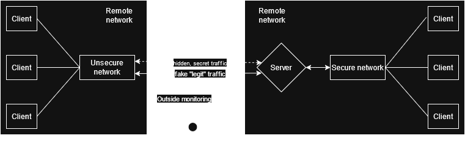
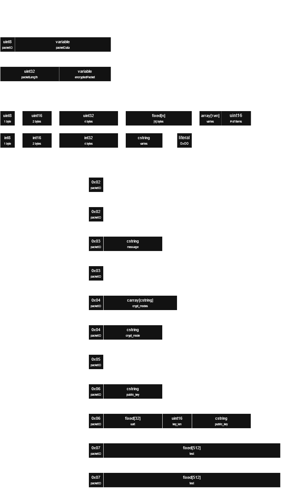
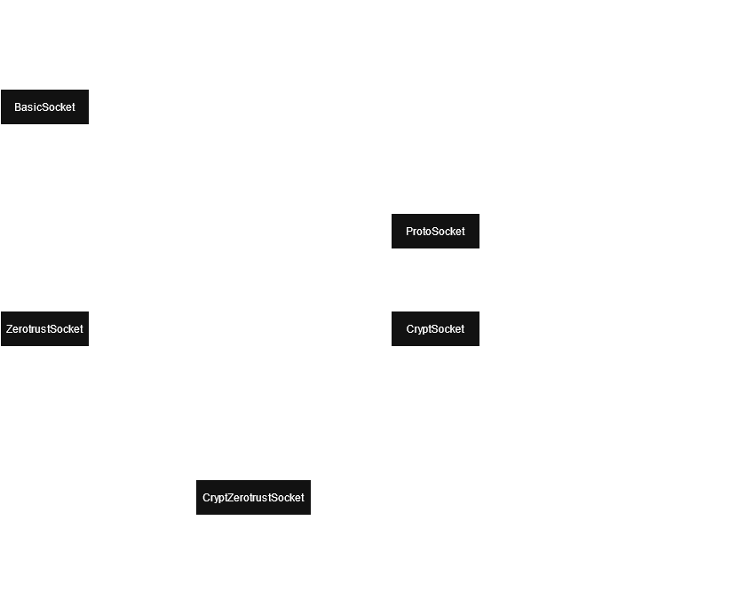

<div align=center>
<h1>Hyphen0</h1>

<p>Secure and hidden data transport layer</p>
</div>

**Hyphen0** is a protocol standard of DPI‑ and human‑inspection‑resistant data transfer protocol.  
It provides a full‑stack solution for secure, zero‑trust communications over sockets, supporting both client and server roles, extensible encryption and steganographic layers.

It's primary motivation is to protect traffic from being analysed even during handshake stages, to prevent outside monitoring from seeing true metadata (i.e. in case of DPI analysis)



The project aims to make data transfer:
- **Hidden**: By obfuscating protocol data in popular internet protocols to resist deep‑packet inspection (DPI) techniques, also preventing easy human analysis of traffic patterns.  
- **Secure**: Everything after the handshake is encrypted using session key that is discarded after connection terminates, so even if one session was compromised, others will not be affected.
- **Up to modern standarts**: Each session is cryptographically secured using industry standard encryption and key-exchange methods.

While mostly only describing a standard, this repository also contains (currently incomplete and slightly incorrect) implementation of this protocol in python.
## Architecture
 
### Packets and Data types


### Socket Types
this is kinda scuffed, but this is what python version looks like on the inside.


## Installation

```bash
# Clone the repository
git clone https://github.com/Def-Try/hyphen0.git
cd hyphen0

# Install the package and dependencies
pip install .
```

The package requires:

- Python 3.8+
- `asyncio`
- `pycryptodome`
- `ua-generator`

These are installed automatically via `setup.py`.

## Quick Start
TODO

## Contributing
Contributions are welcome! Please:

1. Fork the repository.  
2. Create a feature branch.  
3. Write tests for new functionality.  
4. Submit a pull request.

## License
This project is licensed under the MIT License – see the [LICENSE](LICENSE) for details.